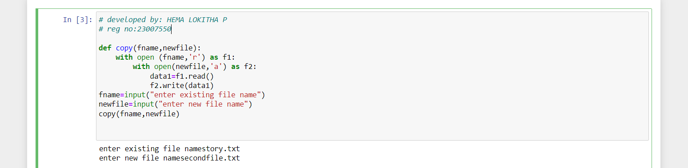

# copy-file
## AIM:
To write a python program for copying the contents from one file to another file.
## EQUIPEMENT'S REQUIRED: 
PC
Anaconda - Python 3.7
## ALGORITHM: 
### Step 1:
Import numpy as np
### Step 2: 
 Enter the input values
### Step 3: 
write a python program for copying the contents from one file to another file.
### Step 4:  
run the program
### Step 5: 
give the input file name
### Step 6: 
end the program
## PROGRAM:

```
# developed by: HEMA LOKITHA P
# reg no:23007550
def copy(fname,newfile):
    with open (fname,'r') as f1:
        with open(newfile,'a') as f2:
            data1=f1.read()
            f2.write(data1)
fname=input("enter existing file name")
newfile=input("enter new file name")
copy(fname,newfile)


```
### OUTPUT:



## RESULT:
Thus the program is written to copy the contents from one file to another file.